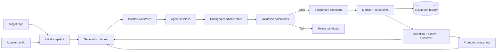

# evo-harness

Optimize codebases with evolutionary search and real benchmarks.

`evo-harness` runs external coding agents in isolated workspaces, validates each
candidate, benchmarks it, and promotes only the best snapshots. It is built for
research and optimization workflows where "better" is measurable by an actual
command, not a vibe.

## Lineage

`evo-harness` is adapted from `autoharness`, which itself was built to scale up
Andrej Karpathy's `autoresearch`.

`autoharness` focused on running `autoresearch` in parallel with isolated
worktrees, automated benchmarking, and longer unattended runs. `evo-harness`
takes that foundation and generalizes it into a broader evolutionary framework:
multiple adapters, command-driven repo integration, immutable snapshots,
population-based search, and explicit mutation, crossover, and elitism.

This repo does not ship the historical `autoresearch` target. The lineage is
kept as context, while the product surface stays focused on reusable,
adapter-driven optimization workflows.

## Why use it

- Bring your own repo, validation commands, and benchmark.
- Use population-based search instead of one-shot agent edits.
- Keep hard constraints separate from objective optimization.
- Track lineage, metrics, constraints, and promoted states in SQLite.
- Run with real agent CLIs such as `claude` and `codex`.

## Good fit

`evo-harness` is a good fit when:

- the agent should only edit a bounded set of files
- you have real validation commands such as tests, compile steps, or checks
- you have a benchmark that emits a numeric metric
- you want repeated, logged optimization runs instead of manual trial-and-error

## How it works



The harness keeps the evolutionary loop generic. Adapters define what can be
edited, how validation runs, and how benchmark metrics are produced.

## Quick start

Requirements:

- Python 3.10+
- git
- a logged-in agent CLI for real evolution runs (`claude` or `codex`)

Install from a source checkout:

```bash
python3 -m pip install -e .
```

The CLI is `evo-harness`.

Inspect the bundled demo target:

```bash
evo-harness demo
```

Plan a run without launching agent sessions:

```bash
evo-harness run \
  --adapter command_repo \
  --repo examples/command_repo_demo/repo \
  --adapter-config examples/command_repo_demo/adapter.json \
  --population-size 2 \
  --workers 1 \
  --gpus 0 \
  --dry-run
```

Benchmark only the baseline seed:

```bash
evo-harness run \
  --adapter command_repo \
  --repo examples/command_repo_demo/repo \
  --adapter-config examples/command_repo_demo/adapter.json \
  --population-size 1 \
  --workers 1 \
  --gpus 0 \
  --max-generations 0
```

Run one actual evolutionary generation:

```bash
evo-harness run \
  --adapter command_repo \
  --repo examples/command_repo_demo/repo \
  --adapter-config examples/command_repo_demo/adapter.json \
  --population-size 2 \
  --workers 1 \
  --gpus 0 \
  --max-generations 1 \
  --agent-runner codex
```

The demo is intentionally small and CPU-only:

- `candidate.py` is the editable artifact
- `py_compile` and a unit test are hard validation gates
- `evaluate.py` emits JSON metrics to stdout

## Bring your own repo

Start with `command_repo` unless you truly need custom Python adapter logic.

Use `command_repo` when your task can be described as:

- editable artifacts
- optional context files
- one or more validation commands
- one benchmark command that emits JSON metrics

Minimal config shape:

```json
{
  "objective": {
    "name": "score",
    "direction": "maximize",
    "description": "Higher is better.",
    "primary_metric": "score"
  },
  "editable_artifacts": ["src/model.py"],
  "context_files": ["README.md", "evaluate.py"],
  "validation_commands": [["python3", "-m", "pytest", "-q"]],
  "benchmark_command": ["python3", "evaluate.py"],
  "required_metrics": ["score"],
  "requires_gpu": false
}
```

Then run:

```bash
evo-harness run \
  --adapter command_repo \
  --repo /path/to/repo \
  --adapter-config /path/to/adapter.json \
  --population-size 4 \
  --workers 2 \
  --gpus 0
```

The benchmark may emit JSON either:

- directly to stdout, or
- to a file specified by `benchmark_output_path`

See [`examples/command_repo_demo/adapter.json`](./examples/command_repo_demo/adapter.json)
for a complete example and
[`docs/authoring_adapters.md`](./docs/authoring_adapters.md) for the adapter
contract.

## Included adapters

- `command_repo`: recommended starting point for arbitrary repos with command-based validation and benchmarking
- `foundry_hook`: advanced config-driven adapter for external Foundry repos

## Advanced example: Foundry

`foundry_hook` is the reusable advanced pattern for external Foundry repos. It
shows how to evolve a smart-contract codebase while keeping `forge` validation
as hard constraints and using a repo-coupled evaluator for optimization.

Start with
[`examples/foundry_hook/README.md`](./examples/foundry_hook/README.md). It
includes three template configs:

- `fee_policy.json`
- `production_policy.json`
- `auction_design.json`

If you want to see a filled-in case study, the Uni V4-specific example lives in
[`case_studies/uni_v4_hook/README.md`](./case_studies/uni_v4_hook/README.md),
but it is not the recommended starting point.

## How runs are stored

Each run creates:

- `harness/runs/<run-name>/results.db`: lineage, metrics, constraints, objective values, fitness, and promotion history
- `harness/runs/<run-name>/state/snapshots/`: immutable candidate snapshots
- `harness/runs/<run-name>/worktrees/`: isolated per-candidate workspaces with prompts, logs, notes, and lineage files

Promotion happens by selecting immutable snapshots, not by mutating one shared
working tree.

## When to write a custom adapter

Write a custom Python adapter only when `command_repo` is not enough, for
example when:

- candidate state is not just "these repo files changed"
- workspaces need generated files or copied baseline material
- benchmark parsing or constraint logic is repo-specific

The Python adapter interface lives in
[`harness/adapters/base.py`](./harness/adapters/base.py).

## Status

The framework is usable, but still early. The public surface is stabilizing
around:

- `command_repo` for most new integrations
- adapter-driven benchmark contracts
- snapshot-based promotion and SQLite run tracking

If you adopt it today, expect iteration on packaging, examples, and adapter
ergonomics.

## License

[MIT](./LICENSE)
